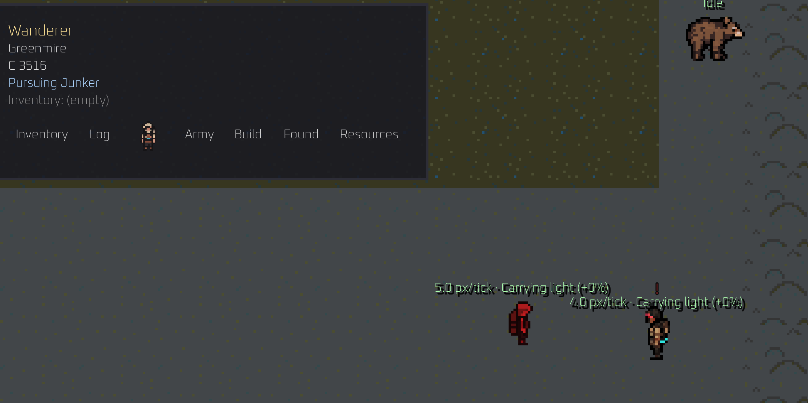
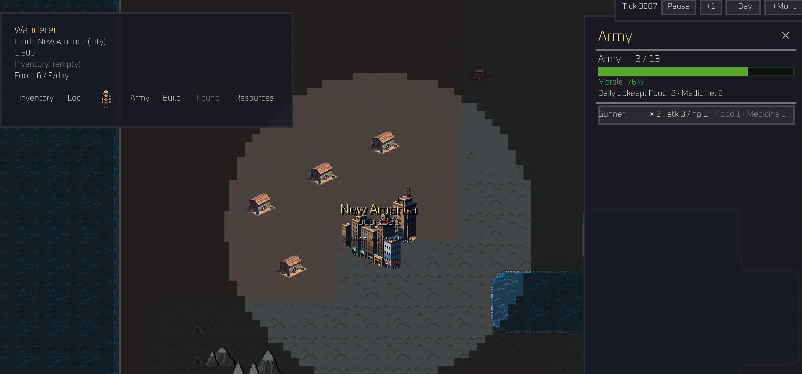

This is the first entry in the **Anarchy** dev blog..because it wouldn't be an indie game 
without a dev blog.

Anarchy is a single-player RPG sandbox game that sets the player in the middle of a robust economic simulation
happening in a rich post-apocolyptic waster world... or at least that's what it hopefully will be some day. Right now
it's a single-player trading sim RPG with battle elements. 

## Why are we here

I don't entierly know why I feel compelled to write down what I'm doing but I feel like this exercise
will be good for whatever end state this game ends up taking. It forces me to think about what this game is and what this
game is not which is a useful exercise when developing something in an environment void of constraints.

## About the game
I started this game (current working title Anarchy) a few months ago and have been working on it on my weekends. I'm setting out to make a great game that I could spend many many hours playing and I hope I can make that a reality here. 

This game itself lends inspiration from Bannerlord, Dwarf Fortress, Kenshi, and probably some others. This sounds like a ridiculous combination of games but let me explain: 
- **Bannerlord** is an open-world medieval role playing game where you start as nobody and slowly recruit soldiers, fight bandits, and trade your way to riches and glory. The high level gameplay will feel very similar to Bannerlord in terms of starting with nothing and going city to city in order to make money and pursue glory. 
- **Dwarf Fortress** - is an insanely deep and detailed simulation game where you guide a colony of dwarves to manage a bustling settlement. Each character has very distinct personality traits and the entire world is procedurally generated. The element Anarchy borrows from Dwarf Fortress is the rich NPC personalities leading to interesting stories/events in the world. I want NPCs to exist as equals to the player with their own hopes, dreams, and schemes. 
- **Kenshi** - is an extremeley open-ended sandbox RPG where you...well do whatever you want. Build a fortress, run a shop in a town, be a trader. Kenshi is phenominal at allowing the user make their way in the world in numerous ways. There is not a paved path. That is the element I want Anarchy to have: true sandbox with no paved path but multiple ways to achieve one goal. 

Obviously I'm planning to give this game my own twist and distinction but when I set out to make a game these were some of my favorite systems of other games over the years and hope I can figure out how to put something interesting out into the world with them. 

## About me
I love single-player sandbox, strategy, RPG, and management games. I'm a sucker for a game that gives you no direction and you can do anything you want in the world. I also just like building things. Whether it's in real life (pottery) or on the computer, I like to make a tangible usable thing and see the thing made. (Whether we will see this thing made is an entire question onto itself).

## AI 
It's 2026. This may be offputting to some, but AI is simply how software is created these days. As a professional software developer during the week I would have zero chance of ever being able to attempt a project like this without LLM tools to expedite the development. So yes: claude is writing almost all of the code for this game. Games with this scope typically take teams of developers years to make, using LLM tools to implement the plumbing required to make a game makes this project possible to even attempt. Tha being said, I think games have the potential to be a high form of art. The visual art, sound, worldbuilding, and game mechanics will be 100% human designed and AI tools give me the time to focus on these aspects. I also won't use AI to write any of these blog posts because, while my own writing skills are pretty rough around the edges, I cannot stand reading AI-written things. 

## Screenshots!
Going to share some very very early screenshots of this game (mostly to prove its existence). I am BAD at art and the art you see is either done by me or is AI generated placeholder assets (yes I will use AI placeholder assets - an entire art overhaul/rework is going to happen at some point).

Combat encounter with a junker (the player is red)\

___

Player entered the settlement New America. 

___

Anyway...if you've made it this far you're either a bot, family or friend, or from the distant future and this game ended up with a following. Thanks for reading and I hope to give an actul entry in the next few weeks after I get back from Europe. 

More soon.
