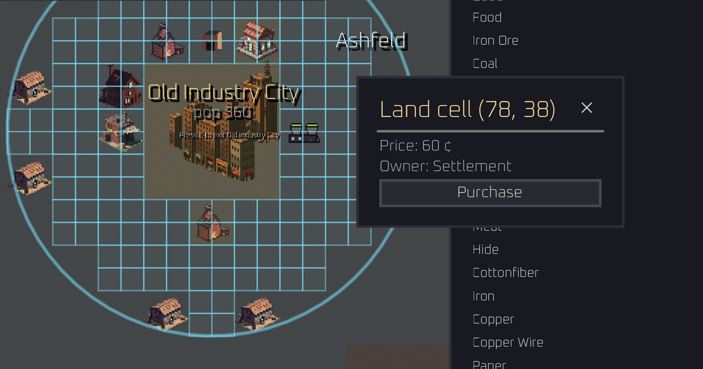
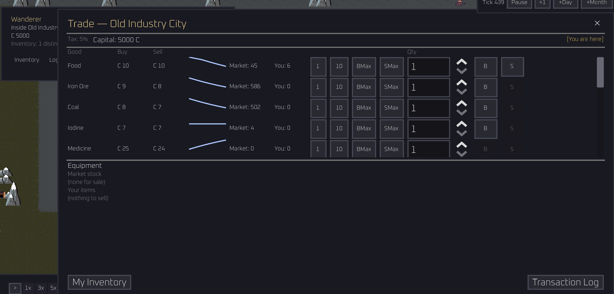
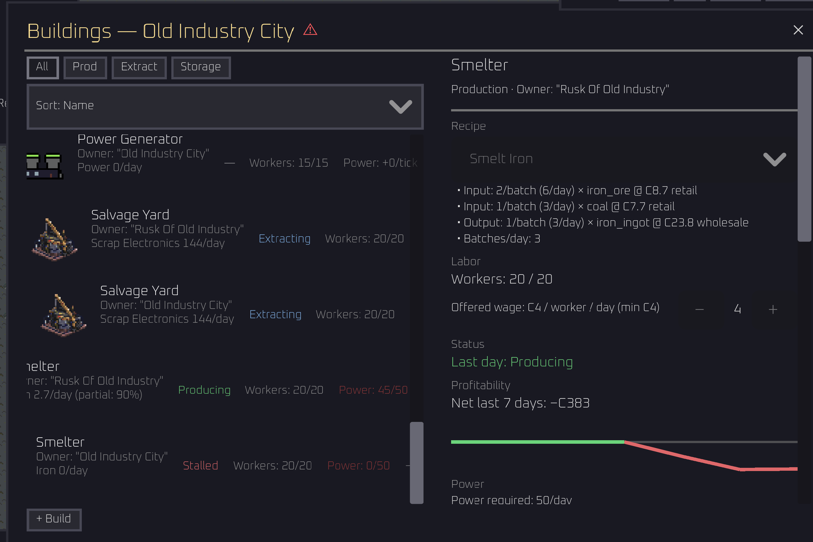

I’m home from Italy and despite having spent 9 days in Europe I’ve actually made quite a lot of progress since the last update a few weeks back. I’ve been mainly focused on getting the core systems into the game, making them “playable”, and iterating on the things that feel too dry even for this stage. I’m pretty content with the systems for crafting, buildings & land ownership, economics, troop recruitment, and NPC “brains”. Posts going into each system in-detail will come eventually, just know that the game is currently playable as a game, it’s just not very fun. 

## Roadmap

I don't entierly know why I feel compelled to write down what I'm doing but I feel like this exercise
will be good for whatever end state this game ends up taking. It forces me to think about what this game is and what this
game is not which is a useful exercise when developing something in an environment void of constraints.

## About the game
As a solo dev with no deadlines, I’m going to start imposing my own on myself. Without constraints nothing will ever get done so I’m setting a target for a playable v0.1 alpha version for **October 1, 2026**. Playable in this context means it would be something that I could hand over to a tester and feel like it is not a total waste of my money and their time. I still don’t expect the game to be particularly fun at that point. 

In order to get me there I’m going to be focusing on the following big things in the coming weeks

- **Content** - the core systems are in place but a lot of the game’s content (buildings, goods, resources, etc) are placeholders. The nice thing is I can just go in with one pass and define the metadata for the game’s real content without changing much code to support it. It’s really a creative exercise on my end. 

- **The Map** - this one I've been putting off for a while as well. I have a map but it’s been temporary. I want to sit down with a pen and paper and really think through what this map is going to feel like. 

- **NPC AI** - this is going to be the beating heart of this game. I want a strong showing of having interesting NPCs from the gate. I need to really sit down and watch/study NPC behavior to adjust things as necessary. I also want to add more traits, archetypes, and ways that NPCs can interact with the world. 

- **Art** - this one truly terrifies me. I’m not a great visual artist but I’m determined to make this a visually beautiful game at some point. (I’m learning/practicing pixel art and drawing but I may need to hire someone). You’ll see from the current screenshots that this game looks like utter shit as it stands. By October I’d like to replace all of the placeholder sprites with better placeholder sprites. I don’t promise not to include any AI generated sprites at this point but by the time this game is generally available for people to play there will not be any AI generated assets in there. 
- **Menus** - this is going to be a menu heavy game. I’m working on sketching out all the menus thinking of the UX and how to best present the information. This will also probably include picking a better font, game color schemes, etc. Lots of visuals. 

## What Is "Fun"
I love single-player sandbox, strategy, RPG, and management games. I'm a sucker for a game that gives you no direction and you can do anything you want in the world. I also just like building things. Whether it's in real life (pottery) or on the computer, I like to make a tangible usable thing and see the thing made. (Whether we will see this thing made is an entire question onto itself).

## Till Next Time 
Thank you for reading, next post probably soonish. Here are some more shitty looking screenshots just to keep showing things off 

Land purchasing experience (puke)

___

More settlement/trading view 

___

Buildings View

